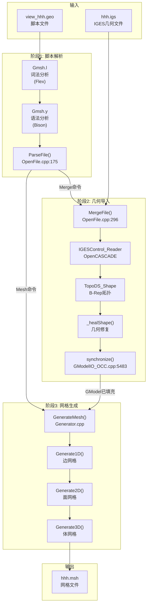

# Gmsh 完整工作流程深度剖析

> 以 `hhh.igs` 为实例，从 IGES 文件到网格生成的全流程解析

---

## 目录

1. [总览：三大阶段](#1-总览三大阶段)
2. [阶段一：脚本解析](#2-阶段一脚本解析)
3. [阶段二：几何导入](#3-阶段二几何导入)
4. [阶段三：网格生成](#4-阶段三网格生成)
5. [数据结构转换](#5-数据结构转换)
6. [完整调用链](#6-完整调用链)
7. [源码速查表](#7-源码速查表)

---

## 1. 总览：三大阶段

### 1.1 完整流程图

```
┌─────────────────────────────────────────────────────────────────────────────┐
│                        Gmsh 完整工作流程总览                                   │
├─────────────────────────────────────────────────────────────────────────────┤
│                                                                             │
│   用户输入                                                                   │
│   ────────                                                                  │
│   view_hhh.geo 脚本:                                                        │
│   ┌─────────────────────────────────┐                                       │
│   │ SetFactory("OpenCASCADE");      │                                       │
│   │ Merge "hhh.igs";                │                                       │
│   │ Mesh 2;                         │                                       │
│   └─────────────────────────────────┘                                       │
│                    │                                                        │
│                    ▼                                                        │
│   ╔═══════════════════════════════════════════════════════════════════╗    │
│   ║  阶段1: 脚本解析 (Parser)                                          ║    │
│   ║  ─────────────────────────────────────────────────────────────    ║    │
│   ║  • Gmsh.l (Flex) - 词法分析，识别 Token                            ║    │
│   ║  • Gmsh.y (Bison) - 语法分析，执行语义动作                          ║    │
│   ║  • 输出：命令执行序列                                               ║    │
│   ╚═══════════════════════════════════════════════════════════════════╝    │
│                    │                                                        │
│                    ▼                                                        │
│   ╔═══════════════════════════════════════════════════════════════════╗    │
│   ║  阶段2: 几何导入 (Geometry Import)                                 ║    │
│   ║  ─────────────────────────────────────────────────────────────    ║    │
│   ║  • IGESControl_Reader - OpenCASCADE 读取 IGES                     ║    │
│   ║  • TopoDS_Shape - B-Rep 拓扑结构                                   ║    │
│   ║  • _healShape() - 几何修复                                         ║    │
│   ║  • synchronize() - 同步到 GModel                                   ║    │
│   ║  • 输出：GVertex/GEdge/GFace/GRegion 实体集合                      ║    │
│   ╚═══════════════════════════════════════════════════════════════════╝    │
│                    │                                                        │
│                    ▼                                                        │
│   ╔═══════════════════════════════════════════════════════════════════╗    │
│   ║  阶段3: 网格生成 (Mesh Generation)                                 ║    │
│   ║  ─────────────────────────────────────────────────────────────    ║    │
│   ║  • Generate1D() - 边上生成线段网格                                  ║    │
│   ║  • Generate2D() - 面上生成三角形/四边形网格                         ║    │
│   ║  • Generate3D() - 体上生成四面体/六面体网格                         ║    │
│   ║  • 输出：MVertex/MElement 网格数据                                 ║    │
│   ╚═══════════════════════════════════════════════════════════════════╝    │
│                    │                                                        │
│                    ▼                                                        │
│   输出结果                                                                   │
│   ────────                                                                  │
│   hhh.msh 网格文件                                                          │
│                                                                             │
└─────────────────────────────────────────────────────────────────────────────┘
```

### 1.2 Mermaid 流程图



### 1.3 为什么是这三个阶段？

| 阶段 | 为什么需要？ | 前提条件 | 产出结果 |
|------|------------|---------|---------|
| **脚本解析** | 用户通过 .geo 脚本与 Gmsh 交互，需要将文本命令转换为可执行的操作 | 有效的 .geo 脚本文件 | 命令执行序列 |
| **几何导入** | CAD 软件生成的 IGES 格式需要转换为 Gmsh 内部几何表示，才能进行网格划分 | 有效的 IGES 文件 + OCC 内核 | GModel 几何实体 |
| **网格生成** | 将连续的几何曲面离散化为有限个网格单元，供后续 FEM 分析使用 | 已加载的几何模型 | MElement 网格数据 |

---

## 2. 阶段一：脚本解析

### 2.1 执行流程详图

```
┌─────────────────────────────────────────────────────────────────────────┐
│                          脚本解析详细流程                                  │
├─────────────────────────────────────────────────────────────────────────┤
│                                                                         │
│   view_hhh.geo 文件内容:                                                 │
│   ┌───────────────────────────────────────┐                             │
│   │ SetFactory("OpenCASCADE");            │ ← 行1                       │
│   │ Merge "hhh.igs";                      │ ← 行2                       │
│   │ Mesh.SurfaceFaces = 1;                │ ← 行3                       │
│   │ Mesh 2;                               │ ← 行4                       │
│   └───────────────────────────────────────┘                             │
│                         │                                               │
│                         ▼                                               │
│   ┌───────────────────────────────────────────────────────────────┐    │
│   │  Step 1: 文件打开                                              │    │
│   │  ───────────────────                                          │    │
│   │  位置: src/common/OpenFile.cpp:175                            │    │
│   │  函数: ParseFile(fileName)                                     │    │
│   │  动作: Fopen(fileName, "rb") 打开文件                          │    │
│   └───────────────────────────────────────────────────────────────┘    │
│                         │                                               │
│                         ▼                                               │
│   ┌───────────────────────────────────────────────────────────────┐    │
│   │  Step 2: 词法分析 (Lexical Analysis)                           │    │
│   │  ───────────────────────────────────                          │    │
│   │  位置: src/parser/Gmsh.l                                       │    │
│   │  工具: Flex                                                    │    │
│   │  动作:                                                         │    │
│   │    "SetFactory" → tSetFactory token                           │    │
│   │    "Merge"      → 识别为命令                                   │    │
│   │    "hhh.igs"    → 字符串常量                                   │    │
│   │    "Mesh"       → tMesh token                                  │    │
│   │    "2"          → 数字常量                                     │    │
│   └───────────────────────────────────────────────────────────────┘    │
│                         │                                               │
│                         ▼                                               │
│   ┌───────────────────────────────────────────────────────────────┐    │
│   │  Step 3: 语法分析 (Syntax Analysis)                            │    │
│   │  ───────────────────────────────────                          │    │
│   │  位置: src/parser/Gmsh.y                                       │    │
│   │  工具: Bison                                                   │    │
│   │  动作: 匹配语法规则，执行语义动作                                │    │
│   │                                                                │    │
│   │  规则示例:                                                     │    │
│   │  tSetFactory '(' StringExprVar ')' tEND                       │    │
│   │  {                                                             │    │
│   │      gmsh_yyfactory = $3;  // 设置工厂为 "OpenCASCADE"        │    │
│   │      if(gmsh_yyfactory == "OpenCASCADE") {                    │    │
│   │          GModel::current()->createOCCInternals();             │    │
│   │      }                                                         │    │
│   │  }                                                             │    │
│   └───────────────────────────────────────────────────────────────┘    │
│                         │                                               │
│                         ▼                                               │
│   ┌───────────────────────────────────────────────────────────────┐    │
│   │  Step 4: 命令执行                                              │    │
│   │  ───────────────────                                          │    │
│   │  每个命令的语义动作直接调用对应的 C++ 函数                       │    │
│   │                                                                │    │
│   │  SetFactory → createOCCInternals()                            │    │
│   │  Merge      → MergeFile("hhh.igs")                            │    │
│   │  Mesh 2     → GModel::current()->mesh(2)                      │    │
│   └───────────────────────────────────────────────────────────────┘    │
│                                                                         │
└─────────────────────────────────────────────────────────────────────────┘
```

### 2.2 SetFactory("OpenCASCADE") 命令详解

**为什么需要这个命令？**

Gmsh 有两个几何内核：
1. **内置引擎 (GEO)**: 简单几何，无法读取 IGES/STEP
2. **OpenCASCADE (OCC)**: 工业级 CAD 内核，支持复杂几何和标准格式

要读取 `hhh.igs`，必须先激活 OCC 内核。

**源码位置**: `src/parser/Gmsh.y:290-318`

```cpp
tSetFactory '(' StringExprVar ')' tEND
{
    // 1. 同步已有的几何改动
    if(GModel::current()->getGEOInternals()->getChanged())
        GModel::current()->getGEOInternals()->synchronize(GModel::current());
    if(GModel::current()->getOCCInternals() &&
       GModel::current()->getOCCInternals()->getChanged())
        GModel::current()->getOCCInternals()->synchronize(GModel::current());

    // 2. 设置工厂名称
    gmsh_yyfactory = $3;  // $3 = "OpenCASCADE"

    // 3. 创建 OCC 内核（如果不存在）
    if(gmsh_yyfactory == "OpenCASCADE"){
        if(!GModel::current()->getOCCInternals())
            GModel::current()->createOCCInternals();  // 关键：创建OCC内核
        // 同步标签编号
        for(int dim = -2; dim <= 3; dim++)
            GModel::current()->getOCCInternals()->setMaxTag(dim, ...);
    }
}
```

**前因后果**:
- **前因**: 用户脚本第一行是 `SetFactory("OpenCASCADE")`
- **动作**: 创建 `OCC_Internals` 对象，准备接收 CAD 数据
- **后果**: 后续的 `Merge` 命令可以调用 OpenCASCADE 读取 IGES 文件

### 2.3 Merge 命令详解

**源码位置**: `src/parser/Gmsh.y:3407-3416`

```cpp
else if(!strcmp($1, "Merge") || !strcmp($1, "MergeWithBoundingBox")){
    // 1. 同步两个内核的几何数据
    if(GModel::current()->getOCCInternals() &&
       GModel::current()->getOCCInternals()->getChanged())
        GModel::current()->getOCCInternals()->synchronize(GModel::current());
    if(GModel::current()->getGEOInternals()->getChanged())
        GModel::current()->getGEOInternals()->synchronize(GModel::current());

    // 2. 修正相对路径
    std::string tmp = FixRelativePath(gmsh_yyname, $2);

    // 3. 调用 MergeFile 函数
    MergeFile(tmp, true);
}
```

**前因后果**:
- **前因**: `SetFactory` 已创建 OCC 内核
- **动作**: 调用 `MergeFile()` 读取 `hhh.igs`
- **后果**: 触发阶段2的几何导入流程

### 2.4 Mesh 命令详解

**源码位置**: `src/parser/Gmsh.y:3508-3518`

```cpp
else if(!strcmp($1, "Mesh")) {
    int lock = CTX::instance()->lock;
    CTX::instance()->lock = 0;

    // 同步几何内核
    if(GModel::current()->getOCCInternals() &&
       GModel::current()->getOCCInternals()->getChanged())
        GModel::current()->getOCCInternals()->synchronize(GModel::current());
    if(GModel::current()->getGEOInternals()->getChanged())
        GModel::current()->getGEOInternals()->synchronize(GModel::current());

    // 调用网格生成
    GModel::current()->mesh((int)$2);  // $2 = 2 (维度)

    CTX::instance()->lock = lock;
}
```

**前因后果**:
- **前因**: 几何模型已加载到 GModel
- **动作**: 调用 `GModel::mesh(2)` 生成2D网格
- **后果**: 触发阶段3的网格生成流程

---

## 3. 阶段二：几何导入

### 3.1 执行流程详图

```
┌─────────────────────────────────────────────────────────────────────────┐
│                          几何导入详细流程                                  │
├─────────────────────────────────────────────────────────────────────────┤
│                                                                         │
│   hhh.igs 文件 (IGES格式)                                                │
│   ┌───────────────────────────────────────┐                             │
│   │ IGES 5.3 格式                          │                             │
│   │ 包含: 点、曲线、曲面、实体的参数化描述   │                             │
│   └───────────────────────────────────────┘                             │
│                         │                                               │
│                         ▼                                               │
│   ┌───────────────────────────────────────────────────────────────┐    │
│   │  Step 1: MergeFile() 入口                                      │    │
│   │  ───────────────────────────                                  │    │
│   │  位置: src/common/OpenFile.cpp:296                            │    │
│   │  动作:                                                         │    │
│   │    1. 打开文件 Fopen(fileName, "rb")                          │    │
│   │    2. 读取文件头识别格式                                       │    │
│   │    3. 根据扩展名 ".igs" 判断为 IGES 格式                       │    │
│   │    4. 调用 GModel::readOCCIGES()                              │    │
│   └───────────────────────────────────────────────────────────────┘    │
│                         │                                               │
│                         ▼                                               │
│   ┌───────────────────────────────────────────────────────────────┐    │
│   │  Step 2: GModel::readOCCIGES()                                 │    │
│   │  ───────────────────────────────                              │    │
│   │  位置: src/geo/GModelIO_OCC.cpp:6783-6790                     │    │
│   │  代码:                                                         │    │
│   │  int GModel::readOCCIGES(const std::string &fn)               │    │
│   │  {                                                             │    │
│   │      if(!_occ_internals)                                      │    │
│   │          _occ_internals = new OCC_Internals;  // 确保OCC存在   │    │
│   │                                                                │    │
│   │      std::vector<std::pair<int, int>> outDimTags;             │    │
│   │                                                                │    │
│   │      _occ_internals->importShapes(fn, false, outDimTags,      │    │
│   │                                   "iges");  // 核心导入        │    │
│   │                                                                │    │
│   │      _occ_internals->synchronize(this);  // 同步到GModel      │    │
│   │                                                                │    │
│   │      return 1;                                                 │    │
│   │  }                                                             │    │
│   └───────────────────────────────────────────────────────────────┘    │
│                         │                                               │
│                         ▼                                               │
│   ┌───────────────────────────────────────────────────────────────┐    │
│   │  Step 3: OCC_Internals::importShapes()                         │    │
│   │  ─────────────────────────────────────                        │    │
│   │  位置: src/geo/GModelIO_OCC.cpp:4790-4877                     │    │
│   │                                                                │    │
│   │  子步骤 3.1: 创建 IGES 读取器                                   │    │
│   │  ┌─────────────────────────────────────────────────────┐      │    │
│   │  │  IGESControl_Reader reader;                          │      │    │
│   │  │  setTargetUnit(reader);  // 设置单位 (mm/m/inch)    │      │    │
│   │  └─────────────────────────────────────────────────────┘      │    │
│   │                         │                                      │    │
│   │                         ▼                                      │    │
│   │  子步骤 3.2: 读取 IGES 文件                                     │    │
│   │  ┌─────────────────────────────────────────────────────┐      │    │
│   │  │  IFSelect_ReturnStatus status =                      │      │    │
│   │  │      reader.ReadFile(fileName.c_str());              │      │    │
│   │  │  // 解析 IGES 实体定义                                │      │    │
│   │  └─────────────────────────────────────────────────────┘      │    │
│   │                         │                                      │    │
│   │                         ▼                                      │    │
│   │  子步骤 3.3: 转移到 B-Rep                                       │    │
│   │  ┌─────────────────────────────────────────────────────┐      │    │
│   │  │  int nbRoots = reader.NbRootsForTransfer();          │      │    │
│   │  │  reader.TransferRoots();  // 将IGES实体转为B-Rep     │      │    │
│   │  │  TopoDS_Shape result = reader.OneShape();            │      │    │
│   │  └─────────────────────────────────────────────────────┘      │    │
│   │                         │                                      │    │
│   │                         ▼                                      │    │
│   │  子步骤 3.4: 几何修复                                           │    │
│   │  ┌─────────────────────────────────────────────────────┐      │    │
│   │  │  BRepTools::Clean(result);  // 清理拓扑               │      │    │
│   │  │  _healShape(result, ...);   // 修复问题               │      │    │
│   │  │    ├── occFixDegenerated   // 修复退化实体            │      │    │
│   │  │    ├── occFixSmallEdges    // 修复小边                │      │    │
│   │  │    ├── occFixSmallFaces    // 修复小面                │      │    │
│   │  │    ├── occSewFaces         // 缝合面                  │      │    │
│   │  │    └── occMakeSolids       // 创建实心体              │      │    │
│   │  └─────────────────────────────────────────────────────┘      │    │
│   │                         │                                      │    │
│   │                         ▼                                      │    │
│   │  子步骤 3.5: 创建标签映射                                       │    │
│   │  ┌─────────────────────────────────────────────────────┐      │    │
│   │  │  _multiBind(result, -1, outDimTags, ...);            │      │    │
│   │  │  // 为每个 TopoDS 实体分配唯一标签                     │      │    │
│   │  │  // 存储到内部映射表: _vmap, _emap, _fmap, _somap    │      │    │
│   │  └─────────────────────────────────────────────────────┘      │    │
│   └───────────────────────────────────────────────────────────────┘    │
│                         │                                               │
│                         ▼                                               │
│   ┌───────────────────────────────────────────────────────────────┐    │
│   │  Step 4: OCC_Internals::synchronize()                          │    │
│   │  ────────────────────────────────────                         │    │
│   │  位置: src/geo/GModelIO_OCC.cpp:5483-5654                     │    │
│   │                                                                │    │
│   │  核心任务: 将 OpenCASCADE 拓扑转换为 Gmsh 几何实体              │    │
│   │                                                                │    │
│   │  ┌─────────────────────────────────────────────────────┐      │    │
│   │  │  for(int i=1; i<=_vmap.Extent(); i++) {              │      │    │
│   │  │      TopoDS_Vertex v = TopoDS::Vertex(_vmap(i));     │      │    │
│   │  │      OCCVertex *occv = new OCCVertex(model, v, tag); │      │    │
│   │  │      model->add(occv);  // 添加到 GModel              │      │    │
│   │  │  }                                                    │      │    │
│   │  └─────────────────────────────────────────────────────┘      │    │
│   │  ┌─────────────────────────────────────────────────────┐      │    │
│   │  │  for(int i=1; i<=_emap.Extent(); i++) {              │      │    │
│   │  │      TopoDS_Edge e = TopoDS::Edge(_emap(i));         │      │    │
│   │  │      OCCEdge *occe = new OCCEdge(model, e, tag,      │      │    │
│   │  │                                  v1, v2);            │      │    │
│   │  │      model->add(occe);                                │      │    │
│   │  │  }                                                    │      │    │
│   │  └─────────────────────────────────────────────────────┘      │    │
│   │  ┌─────────────────────────────────────────────────────┐      │    │
│   │  │  for(int i=1; i<=_fmap.Extent(); i++) {              │      │    │
│   │  │      TopoDS_Face f = TopoDS::Face(_fmap(i));         │      │    │
│   │  │      OCCFace *occf = new OCCFace(model, f, tag);     │      │    │
│   │  │      model->add(occf);                                │      │    │
│   │  │  }                                                    │      │    │
│   │  └─────────────────────────────────────────────────────┘      │    │
│   │  ┌─────────────────────────────────────────────────────┐      │    │
│   │  │  for(int i=1; i<=_somap.Extent(); i++) {             │      │    │
│   │  │      TopoDS_Solid s = TopoDS::Solid(_somap(i));      │      │    │
│   │  │      OCCRegion *occr = new OCCRegion(model, s, tag); │      │    │
│   │  │      model->add(occr);                                │      │    │
│   │  │  }                                                    │      │    │
│   │  └─────────────────────────────────────────────────────┘      │    │
│   └───────────────────────────────────────────────────────────────┘    │
│                         │                                               │
│                         ▼                                               │
│   输出结果                                                               │
│   ────────                                                              │
│   GModel 包含:                                                          │
│   • 多个 GVertex (顶点)                                                  │
│   • 多个 GEdge (边/曲线)                                                 │
│   • 多个 GFace (面/曲面)                                                 │
│   • 多个 GRegion (体/实体)                                               │
│                                                                         │
└─────────────────────────────────────────────────────────────────────────┘
```

### 3.2 为什么需要 _healShape() 几何修复？

**问题背景**:
IGES 是一种古老的 CAD 交换格式（1980年代），不同软件生成的 IGES 文件可能存在：
- 曲面边界不完全重合（缝隙）
- 退化的边或面（面积为零）
- 过小的几何特征（小边、小面）
- 非封闭的壳体

**修复操作**:

| 操作 | 配置选项 | 作用 |
|-----|---------|------|
| `occFixDegenerated` | `CTX::instance()->geom.occFixDegenerated` | 移除退化实体 |
| `occFixSmallEdges` | `CTX::instance()->geom.occFixSmallEdges` | 合并过短的边 |
| `occFixSmallFaces` | `CTX::instance()->geom.occFixSmallFaces` | 合并过小的面 |
| `occSewFaces` | `CTX::instance()->geom.occSewFaces` | 缝合相邻面的缝隙 |
| `occMakeSolids` | `CTX::instance()->geom.occMakeSolids` | 尝试创建封闭实体 |

**前因后果**:
- **前因**: IGES 文件可能有几何缺陷
- **动作**: `_healShape()` 自动修复常见问题
- **后果**: 得到干净的 B-Rep 拓扑，为网格生成做准备

### 3.3 B-Rep 到 GEntity 的映射关系

```
┌─────────────────────────────────────────────────────────────────────┐
│                    B-Rep 与 GEntity 映射关系                          │
├─────────────────────────────────────────────────────────────────────┤
│                                                                     │
│   OpenCASCADE B-Rep               Gmsh GEntity                     │
│   ──────────────────              ─────────────                     │
│                                                                     │
│   TopoDS_Vertex  ─────────────►  OCCVertex (GVertex子类)           │
│       │                              │                              │
│       │ 参数: 3D坐标                  │ 存储: 坐标、网格尺寸         │
│       │                              │                              │
│   TopoDS_Edge    ─────────────►  OCCEdge (GEdge子类)               │
│       │                              │                              │
│       │ 参数: 起点、终点、曲线参数    │ 存储: 边界顶点、参数化       │
│       │                              │                              │
│   TopoDS_Face    ─────────────►  OCCFace (GFace子类)               │
│       │                              │                              │
│       │ 参数: 边界环、曲面参数        │ 存储: 边界边、参数域         │
│       │                              │                              │
│   TopoDS_Solid   ─────────────►  OCCRegion (GRegion子类)           │
│       │                              │                              │
│       │ 参数: 边界壳                  │ 存储: 边界面                 │
│                                                                     │
└─────────────────────────────────────────────────────────────────────┘
```

### 3.4 内部映射表

OCC_Internals 维护了以下映射表（`src/geo/GModelIO_OCC.cpp`）：

| 映射表 | 类型 | 用途 |
|-------|------|------|
| `_vmap` | `TopTools_IndexedMapOfShape` | 顶点: tag → TopoDS_Vertex |
| `_emap` | `TopTools_IndexedMapOfShape` | 边: tag → TopoDS_Edge |
| `_fmap` | `TopTools_IndexedMapOfShape` | 面: tag → TopoDS_Face |
| `_wmap` | `TopTools_IndexedMapOfShape` | 线框: tag → TopoDS_Wire |
| `_shmap` | `TopTools_IndexedMapOfShape` | 壳: tag → TopoDS_Shell |
| `_somap` | `TopTools_IndexedMapOfShape` | 实体: tag → TopoDS_Solid |

---

## 4. 阶段三：网格生成

### 4.1 执行流程详图

```
┌─────────────────────────────────────────────────────────────────────────┐
│                          网格生成详细流程                                  │
├─────────────────────────────────────────────────────────────────────────┤
│                                                                         │
│   输入: GModel (包含 GVertex, GEdge, GFace, GRegion)                    │
│                                                                         │
│   ┌───────────────────────────────────────────────────────────────┐    │
│   │  Step 1: GModel::mesh(dim) 入口                                │    │
│   │  ───────────────────────────────                              │    │
│   │  位置: src/geo/GModel.cpp:1160-1177                           │    │
│   │  代码:                                                         │    │
│   │  int GModel::mesh(int dimension)                               │    │
│   │  {                                                             │    │
│   │      GenerateMesh(this, dimension);  // 核心调用               │    │
│   │                                                                │    │
│   │      if(CTX::instance()->mesh.renumber) {                     │    │
│   │          renumberMeshVertices();   // 重新编号顶点             │    │
│   │          renumberMeshElements();   // 重新编号单元             │    │
│   │      }                                                         │    │
│   │                                                                │    │
│   │      computeHomology(newPhysicals);  // 计算同调               │    │
│   │      return true;                                              │    │
│   │  }                                                             │    │
│   └───────────────────────────────────────────────────────────────┘    │
│                         │                                               │
│                         ▼                                               │
│   ┌───────────────────────────────────────────────────────────────┐    │
│   │  Step 2: GenerateMesh() 网格生成器                             │    │
│   │  ─────────────────────────────────                            │    │
│   │  位置: src/mesh/Generator.cpp                                  │    │
│   │                                                                │    │
│   │  if(dimension >= 1) Generate1D(model);  // 边网格              │    │
│   │  if(dimension >= 2) Generate2D(model);  // 面网格              │    │
│   │  if(dimension >= 3) Generate3D(model);  // 体网格              │    │
│   └───────────────────────────────────────────────────────────────┘    │
│                         │                                               │
│                         ▼                                               │
│   ╔═══════════════════════════════════════════════════════════════╗    │
│   ║  Generate1D() - 边网格生成                                      ║    │
│   ╠═══════════════════════════════════════════════════════════════╣    │
│   ║                                                                ║    │
│   ║  for(auto it = model->firstEdge(); it != model->lastEdge();   ║    │
│   ║      ++it)                                                     ║    │
│   ║  {                                                             ║    │
│   ║      GEdge *ge = *it;                                          ║    │
│   ║      ge->mesh(true);  // 对每条边进行网格化                     ║    │
│   ║  }                                                             ║    │
│   ║                                                                ║    │
│   ║  结果: 每条 GEdge 上生成 MLine 线段单元                         ║    │
│   ║                                                                ║    │
│   ║  ┌─────────────────────────────────────────────────────┐      ║    │
│   ║  │  GEdge (曲线)                                        │      ║    │
│   ║  │  ●────●────●────●────●                               │      ║    │
│   ║  │  └─MLine─┘                                           │      ║    │
│   ║  │  顶点: MVertex                                        │      ║    │
│   ║  └─────────────────────────────────────────────────────┘      ║    │
│   ╚═══════════════════════════════════════════════════════════════╝    │
│                         │                                               │
│                         ▼                                               │
│   ╔═══════════════════════════════════════════════════════════════╗    │
│   ║  Generate2D() → Mesh2D() - 面网格生成                           ║    │
│   ╠═══════════════════════════════════════════════════════════════╣    │
│   ║  位置: src/mesh/Generator.cpp:533-660+                         ║    │
│   ║                                                                ║    │
│   ║  Step 2.1: 初始化尺寸场                                         ║    │
│   ║  ┌─────────────────────────────────────────────────────┐      ║    │
│   ║  │  m->getFields()->initialize();                       │      ║    │
│   ║  │  // 根据 Mesh.MeshSizeMin/Max 等参数设置尺寸场       │      ║    │
│   ║  └─────────────────────────────────────────────────────┘      ║    │
│   ║                                                                ║    │
│   ║  Step 2.2: 并行网格化所有面                                     ║    │
│   ║  ┌─────────────────────────────────────────────────────┐      ║    │
│   ║  │  #pragma omp parallel for schedule(dynamic)          │      ║    │
│   ║  │  for(size_t K = 0; K < temp.size(); K++)             │      ║    │
│   ║  │  {                                                    │      ║    │
│   ║  │      if(temp[K]->meshStatistics.status == PENDING)   │      ║    │
│   ║  │      {                                                │      ║    │
│   ║  │          temp[K]->mesh(true);  // 关键调用            │      ║    │
│   ║  │      }                                                │      ║    │
│   ║  │  }                                                    │      ║    │
│   ║  └─────────────────────────────────────────────────────┘      ║    │
│   ║                                                                ║    │
│   ║  Step 2.3: 单个面的网格化流程                                   ║    │
│   ║  ┌─────────────────────────────────────────────────────┐      ║    │
│   ║  │  GFace::mesh(bool force)                              │      ║    │
│   ║  │      │                                                │      ║    │
│   ║  │      ▼                                                │      ║    │
│   ║  │  meshGFace functor (src/mesh/meshGFace.cpp)          │      ║    │
│   ║  │      │                                                │      ║    │
│   ║  │      ▼                                                │      ║    │
│   ║  │  选择算法:                                            │      ║    │
│   ║  │    • ALGO_2D_DELAUNAY - Delaunay三角剖分             │      ║    │
│   ║  │    • ALGO_2D_FRONTAL  - 前沿推进法                   │      ║    │
│   ║  │    • ALGO_2D_BAMG     - 自适应网格                   │      ║    │
│   ║  │      │                                                │      ║    │
│   ║  │      ▼                                                │      ║    │
│   ║  │  生成 MTriangle / MQuadrangle 单元                   │      ║    │
│   ║  └─────────────────────────────────────────────────────┘      ║    │
│   ║                                                                ║    │
│   ║  结果: 每个 GFace 上生成三角形/四边形网格                       ║    │
│   ║                                                                ║    │
│   ║  ┌─────────────────────────────────────────────────────┐      ║    │
│   ║  │  GFace (曲面)                                         │      ║    │
│   ║  │    ●─────●─────●                                      │      ║    │
│   ║  │    │╲    │    ╱│                                      │      ║    │
│   ║  │    │ ╲   │   ╱ │      ← MTriangle 三角形单元         │      ║    │
│   ║  │    │  ╲  │  ╱  │                                      │      ║    │
│   ║  │    ●─────●─────●                                      │      ║    │
│   ║  │    │    ╱│╲    │                                      │      ║    │
│   ║  │    │   ╱ │ ╲   │                                      │      ║    │
│   ║  │    │  ╱  │  ╲  │                                      │      ║    │
│   ║  │    ●─────●─────●                                      │      ║    │
│   ║  └─────────────────────────────────────────────────────┘      ║    │
│   ╚═══════════════════════════════════════════════════════════════╝    │
│                         │                                               │
│                         ▼                                               │
│   ╔═══════════════════════════════════════════════════════════════╗    │
│   ║  Generate3D() - 体网格生成 (如果 dim == 3)                      ║    │
│   ╠═══════════════════════════════════════════════════════════════╣    │
│   ║                                                                ║    │
│   ║  for(auto it = model->firstRegion();                           ║    │
│   ║      it != model->lastRegion(); ++it)                          ║    │
│   ║  {                                                             ║    │
│   ║      GRegion *gr = *it;                                        ║    │
│   ║      meshGRegion()(gr);  // 体网格化                           ║    │
│   ║  }                                                             ║    │
│   ║                                                                ║    │
│   ║  结果: 生成四面体/六面体/棱柱/金字塔单元                        ║    │
│   ║                                                                ║    │
│   ║  ┌─────────────────────────────────────────────────────┐      ║    │
│   ║  │  GRegion (体)                                         │      ║    │
│   ║  │                                                       │      ║    │
│   ║  │       ●─────────●                                    │      ║    │
│   ║  │      ╱│        ╱│                                    │      ║    │
│   ║  │     ╱ │       ╱ │      ← MTetrahedron 四面体        │      ║    │
│   ║  │    ●─────────●  │        或其他3D单元               │      ║    │
│   ║  │    │  ●──────│──●                                    │      ║    │
│   ║  │    │ ╱       │ ╱                                     │      ║    │
│   ║  │    │╱        │╱                                      │      ║    │
│   ║  │    ●─────────●                                       │      ║    │
│   ║  └─────────────────────────────────────────────────────┘      ║    │
│   ╚═══════════════════════════════════════════════════════════════╝    │
│                         │                                               │
│                         ▼                                               │
│   输出结果                                                               │
│   ────────                                                              │
│   每个 GEntity 包含:                                                     │
│   • MVertex: 网格顶点坐标                                                │
│   • MElement: 网格单元（线段/三角形/四面体等）                            │
│                                                                         │
└─────────────────────────────────────────────────────────────────────────┘
```

### 4.2 网格生成算法选择

**2D 网格算法** (`Mesh.Algorithm` 选项):

| 算法ID | 名称 | 特点 | 适用场景 |
|-------|------|------|---------|
| 1 | MeshAdapt | 自适应网格 | 复杂几何，需要局部加密 |
| 2 | Automatic | 自动选择 | 一般场景 |
| 5 | Delaunay | Delaunay三角剖分 | 大多数场景，默认推荐 |
| 6 | Frontal-Delaunay | 前沿Delaunay | 规则网格，质量较好 |
| 7 | BAMG | 自适应三角网格 | 需要各向异性网格 |
| 8 | Frontal-Delaunay for Quads | 前沿四边形 | 需要四边形网格 |
| 9 | Packing of Parallelograms | 平行四边形填充 | 规则四边形 |

**3D 网格算法** (`Mesh.Algorithm3D` 选项):

| 算法ID | 名称 | 特点 |
|-------|------|------|
| 1 | Delaunay | 经典Delaunay四面体化 |
| 4 | Frontal | 前沿推进法 |
| 7 | MMG3D | 自适应重网格 |
| 10 | HXT | 高性能并行四面体化 |

### 4.3 网格尺寸控制

**相关参数**:

```geo
Mesh.MeshSizeMin = 100;   // 最小网格尺寸
Mesh.MeshSizeMax = 500;   // 最大网格尺寸
Mesh.MeshSizeFactor = 1;  // 尺寸因子
```

**尺寸场** (`Field`):
尺寸场允许在模型不同区域指定不同的网格尺寸：
- 距离场 (Distance)
- 阈值场 (Threshold)
- 数学表达式场 (MathEval)
- 边界层场 (BoundaryLayer)

### 4.4 为什么网格是逐维度生成的？

**原因**:
1. **拓扑依赖**: 高维单元依赖低维边界
   - 三角形的边必须先有线段网格
   - 四面体的面必须先有三角形网格

2. **参数化约束**:
   - 边界上的网格点在高维网格化时必须保持
   - 确保网格的一致性

3. **并行效率**:
   - 同一维度的实体可以并行网格化
   - 不同维度需要顺序执行

---

## 5. 数据结构转换

### 5.1 完整转换链

```
┌─────────────────────────────────────────────────────────────────────────┐
│                        数据结构转换全景图                                  │
├─────────────────────────────────────────────────────────────────────────┤
│                                                                         │
│   IGES 文件格式                                                          │
│   ─────────────                                                         │
│   ┌───────────────────────────────────────┐                             │
│   │ 参数化实体定义:                         │                             │
│   │ • 点: 3D坐标                           │                             │
│   │ • 曲线: NURBS参数                       │                             │
│   │ • 曲面: 边界表示                        │                             │
│   │ • 实体: 拓扑关系                        │                             │
│   └───────────────────────────────────────┘                             │
│                         │                                               │
│                         │ IGESControl_Reader                            │
│                         ▼                                               │
│   OpenCASCADE B-Rep                                                     │
│   ─────────────────                                                     │
│   ┌───────────────────────────────────────┐                             │
│   │ TopoDS_Shape 层次结构:                  │                             │
│   │                                         │                             │
│   │ TopoDS_Compound (复合体)                │                             │
│   │     └── TopoDS_Solid (实体)             │                             │
│   │             └── TopoDS_Shell (壳)       │                             │
│   │                     └── TopoDS_Face (面)│                             │
│   │                             └── TopoDS_Wire (线框)                   │
│   │                                     └── TopoDS_Edge (边)             │
│   │                                             └── TopoDS_Vertex (点)   │
│   └───────────────────────────────────────┘                             │
│                         │                                               │
│                         │ OCC_Internals::synchronize()                  │
│                         ▼                                               │
│   Gmsh GEntity 体系                                                      │
│   ─────────────────                                                     │
│   ┌───────────────────────────────────────┐                             │
│   │ GModel 包含:                            │                             │
│   │                                         │                             │
│   │ GRegion (体)  ← OCCRegion 子类          │                             │
│   │     │  bounds: std::list<GFace*>       │                             │
│   │     ▼                                   │                             │
│   │ GFace (面)    ← OCCFace 子类            │                             │
│   │     │  edges: std::vector<GEdge*>      │                             │
│   │     ▼                                   │                             │
│   │ GEdge (边)    ← OCCEdge 子类            │                             │
│   │     │  beginVertex, endVertex          │                             │
│   │     ▼                                   │                             │
│   │ GVertex (点)  ← OCCVertex 子类          │                             │
│   │       x, y, z 坐标                      │                             │
│   └───────────────────────────────────────┘                             │
│                         │                                               │
│                         │ GEntity::mesh()                               │
│                         ▼                                               │
│   Gmsh MElement 体系                                                     │
│   ─────────────────                                                     │
│   ┌───────────────────────────────────────┐                             │
│   │ 网格数据:                               │                             │
│   │                                         │                             │
│   │ MVertex (网格顶点)                      │                             │
│   │     x, y, z 坐标                        │                             │
│   │     所属 GEntity                        │                             │
│   │                                         │                             │
│   │ MElement (网格单元) 子类:               │                             │
│   │     │                                   │                             │
│   │     ├── MPoint      (0D)               │                             │
│   │     ├── MLine       (1D, 2节点线段)     │                             │
│   │     ├── MTriangle   (2D, 3节点三角形)   │                             │
│   │     ├── MQuadrangle (2D, 4节点四边形)   │                             │
│   │     ├── MTetrahedron(3D, 4节点四面体)   │                             │
│   │     ├── MHexahedron (3D, 8节点六面体)   │                             │
│   │     ├── MPrism      (3D, 6节点棱柱)     │                             │
│   │     └── MPyramid    (3D, 5节点金字塔)   │                             │
│   └───────────────────────────────────────┘                             │
│                         │                                               │
│                         │ GModel::writeMSH()                            │
│                         ▼                                               │
│   MSH 文件格式                                                           │
│   ────────────                                                          │
│   ┌───────────────────────────────────────┐                             │
│   │ $MeshFormat                             │                             │
│   │ 4.1 0 8                                 │                             │
│   │ $EndMeshFormat                          │                             │
│   │ $Nodes                                  │                             │
│   │ numEntityBlocks numNodes ...            │                             │
│   │ ...                                     │                             │
│   │ $EndNodes                               │                             │
│   │ $Elements                               │                             │
│   │ numEntityBlocks numElements ...         │                             │
│   │ ...                                     │                             │
│   │ $EndElements                            │                             │
│   └───────────────────────────────────────┘                             │
│                                                                         │
└─────────────────────────────────────────────────────────────────────────┘
```

### 5.2 类层次结构

```
┌─────────────────────────────────────────────────────────────────────────┐
│                          类继承关系图                                     │
├─────────────────────────────────────────────────────────────────────────┤
│                                                                         │
│   几何实体 (Geometry Entities)                                           │
│   ─────────────────────────────                                         │
│                                                                         │
│   GEntity (基类)                                                         │
│       │  dim(), tag(), mesh(), ...                                      │
│       │                                                                 │
│       ├── GVertex (0D, 顶点)                                            │
│       │       │  x(), y(), z(), prescribedMeshSize()                   │
│       │       │                                                         │
│       │       └── OCCVertex                                             │
│       │              TopoDS_Vertex _v                                   │
│       │                                                                 │
│       ├── GEdge (1D, 边)                                                │
│       │       │  getBeginVertex(), getEndVertex()                      │
│       │       │  firstDer(), curvature()                               │
│       │       │                                                         │
│       │       └── OCCEdge                                               │
│       │              TopoDS_Edge _e                                     │
│       │              BRepAdaptor_Curve _curve                           │
│       │                                                                 │
│       ├── GFace (2D, 面)                                                │
│       │       │  edges(), normal(), curvatures()                       │
│       │       │                                                         │
│       │       └── OCCFace                                               │
│       │              TopoDS_Face _f                                     │
│       │              BRepAdaptor_Surface _surface                       │
│       │                                                                 │
│       └── GRegion (3D, 体)                                              │
│               │  faces(), edges(), vertices()                          │
│               │                                                         │
│               └── OCCRegion                                             │
│                      TopoDS_Solid _s                                    │
│                                                                         │
│   ─────────────────────────────────────────────────────────────────    │
│                                                                         │
│   网格实体 (Mesh Entities)                                               │
│   ────────────────────────                                              │
│                                                                         │
│   MVertex (网格顶点)                                                     │
│       x, y, z, _ge (所属GEntity)                                        │
│                                                                         │
│   MElement (基类)                                                        │
│       │  getNumVertices(), getVertex(i)                                │
│       │  getVolume(), barycenter()                                     │
│       │                                                                 │
│       ├── MPoint (0D)                                                   │
│       │                                                                 │
│       ├── MLine (1D, 2节点)                                             │
│       │   └── MLine3 (1D, 3节点, 二阶)                                  │
│       │                                                                 │
│       ├── MTriangle (2D, 3节点)                                         │
│       │   ├── MTriangle6 (2D, 6节点, 二阶)                              │
│       │   └── MTriangleN (2D, 高阶)                                     │
│       │                                                                 │
│       ├── MQuadrangle (2D, 4节点)                                       │
│       │   └── MQuadrangle8/9 (2D, 高阶)                                 │
│       │                                                                 │
│       ├── MTetrahedron (3D, 4节点)                                      │
│       │   └── MTetrahedron10 (3D, 10节点, 二阶)                         │
│       │                                                                 │
│       ├── MHexahedron (3D, 8节点)                                       │
│       │   └── MHexahedron20/27 (3D, 高阶)                               │
│       │                                                                 │
│       ├── MPrism (3D, 6节点)                                            │
│       │                                                                 │
│       └── MPyramid (3D, 5节点)                                          │
│                                                                         │
└─────────────────────────────────────────────────────────────────────────┘
```

---

## 6. 完整调用链

### 6.1 以 `hhh.igs` 为例的完整调用链

```
用户命令: gmsh view_hhh.geo
    │
    ▼
main() [src/Gmsh.cpp]
    │
    ├── GmshInitialize()  // 初始化Gmsh
    │
    ├── ParseFile("view_hhh.geo")  // 解析脚本
    │   │
    │   │   [脚本第1行: SetFactory("OpenCASCADE");]
    │   │   │
    │   │   └── Gmsh.y:290-318
    │   │           ├── synchronize() // 同步已有几何
    │   │           └── GModel::current()->createOCCInternals()
    │   │                   └── _occ_internals = new OCC_Internals
    │   │
    │   │   [脚本第2行: Merge "hhh.igs";]
    │   │   │
    │   │   └── Gmsh.y:3407-3416
    │   │           ├── synchronize() // 同步
    │   │           └── MergeFile("hhh.igs", true)
    │   │                   │
    │   │                   └── OpenFile.cpp:379-380
    │   │                           └── GModel::readOCCIGES("hhh.igs")
    │   │                                   │
    │   │                                   └── GModelIO_OCC.cpp:6783-6790
    │   │                                           │
    │   │                                           ├── importShapes()
    │   │                                           │   │
    │   │                                           │   ├── IGESControl_Reader reader
    │   │                                           │   ├── reader.ReadFile()
    │   │                                           │   ├── reader.TransferRoots()
    │   │                                           │   ├── TopoDS_Shape result
    │   │                                           │   ├── BRepTools::Clean()
    │   │                                           │   ├── _healShape()
    │   │                                           │   └── _multiBind()
    │   │                                           │
    │   │                                           └── synchronize(GModel)
    │   │                                                   │
    │   │                                                   ├── _vmap → OCCVertex → GModel::add()
    │   │                                                   ├── _emap → OCCEdge → GModel::add()
    │   │                                                   ├── _fmap → OCCFace → GModel::add()
    │   │                                                   └── _somap → OCCRegion → GModel::add()
    │   │
    │   │   [脚本第3行: Mesh.SurfaceFaces = 1;]
    │   │   │
    │   │   └── Gmsh.y (Affectation规则)
    │   │           └── opt_mesh_surface_faces(1)
    │   │                   └── CTX::instance()->mesh.surfaceFaces = 1
    │   │
    │   │   [脚本第4行: Mesh 2;]
    │   │   │
    │   │   └── Gmsh.y:3508-3518
    │   │           ├── synchronize() // 同步
    │   │           └── GModel::current()->mesh(2)
    │   │                   │
    │   │                   └── GModel.cpp:1160-1177
    │   │                           │
    │   │                           └── GenerateMesh(this, 2)
    │   │                                   │
    │   │                                   └── Generator.cpp
    │   │                                           │
    │   │                                           ├── Generate1D(model)
    │   │                                           │   │
    │   │                                           │   └── for each GEdge:
    │   │                                           │           ge->mesh(true)
    │   │                                           │               └── meshGEdge()
    │   │                                           │                       └── 生成 MLine
    │   │                                           │
    │   │                                           └── Generate2D(model)
    │   │                                                   │
    │   │                                                   └── Mesh2D(model)
    │   │                                                           │
    │   │                                                           └── #pragma omp parallel
    │   │                                                                   for each GFace:
    │   │                                                                       gf->mesh(true)
    │   │                                                                           └── meshGFace()
    │   │                                                                                   │
    │   │                                                                                   ├── 选择算法
    │   │                                                                                   │   (Delaunay等)
    │   │                                                                                   │
    │   │                                                                                   └── 生成
    │   │                                                                                       MTriangle
    │   │
    │   └── 解析完成
    │
    ├── 显示网格 (如果有GUI)
    │
    └── GmshFinalize()  // 清理
```

---

## 7. 源码速查表

### 7.1 按功能分类

| 功能 | 文件路径 | 关键行号 | 主要函数/类 |
|------|---------|---------|------------|
| **脚本解析入口** | `src/common/OpenFile.cpp` | 175-207 | `ParseFile()` |
| **词法分析** | `src/parser/Gmsh.l` | - | Flex规则 |
| **语法分析** | `src/parser/Gmsh.y` | - | Bison规则 |
| **SetFactory** | `src/parser/Gmsh.y` | 290-318 | 语义动作 |
| **Merge命令** | `src/parser/Gmsh.y` | 3407-3416 | 语义动作 |
| **Mesh命令** | `src/parser/Gmsh.y` | 3508-3518 | 语义动作 |
| **MergeFile** | `src/common/OpenFile.cpp` | 296-350 | `MergeFile()` |
| **IGES读取** | `src/geo/GModelIO_OCC.cpp` | 6783-6790 | `GModel::readOCCIGES()` |
| **OCC导入** | `src/geo/GModelIO_OCC.cpp` | 4790-4877 | `OCC_Internals::importShapes()` |
| **几何修复** | `src/geo/GModelIO_OCC.cpp` | 4865-4872 | `_healShape()` |
| **同步到GModel** | `src/geo/GModelIO_OCC.cpp` | 5483-5654 | `OCC_Internals::synchronize()` |
| **网格生成入口** | `src/geo/GModel.cpp` | 1160-1177 | `GModel::mesh()` |
| **网格生成器** | `src/mesh/Generator.cpp` | - | `GenerateMesh()`, `Mesh2D()` |
| **面网格算法** | `src/mesh/meshGFace.cpp` | - | `meshGFace` functor |
| **边网格算法** | `src/mesh/meshGEdge.cpp` | - | `meshGEdge` functor |
| **体网格算法** | `src/mesh/meshGRegion.cpp` | - | `meshGRegion` functor |

### 7.2 按文件分类

| 目录 | 主要文件 | 功能描述 |
|------|---------|---------|
| `src/common/` | `OpenFile.cpp` | 文件操作、脚本解析入口 |
| | `Context.h/cpp` | 全局配置、选项管理 |
| | `Options.h/cpp` | 选项处理函数 |
| `src/parser/` | `Gmsh.l` | Flex词法分析器 |
| | `Gmsh.y` | Bison语法分析器 |
| | `Parser.h` | 解析器全局变量 |
| `src/geo/` | `GModel.h/cpp` | 核心几何模型类 |
| | `GEntity.h` | 几何实体基类 |
| | `GVertex.h`, `GEdge.h`, `GFace.h`, `GRegion.h` | 几何实体类 |
| | `OCCVertex.h/cpp`, `OCCEdge.h/cpp`, `OCCFace.h/cpp`, `OCCRegion.h/cpp` | OCC几何实体 |
| | `GModelIO_OCC.cpp` | OCC格式读写、同步 |
| | `MElement.h`, `MVertex.h` | 网格元素类 |
| `src/mesh/` | `Generator.cpp` | 网格生成器主控 |
| | `meshGEdge.h/cpp` | 边网格化 |
| | `meshGFace.h/cpp` | 面网格化 |
| | `meshGRegion.h/cpp` | 体网格化 |
| | `Field.h/cpp` | 尺寸场 |
| | `BackgroundMesh.h/cpp` | 背景网格 |

---

## 附录：关键配置参数

### 几何配置 (`CTX::instance()->geom.*`)

| 参数 | 默认值 | 说明 |
|------|-------|------|
| `tolerance` | 1e-8 | 几何公差 |
| `occTargetUnit` | "M" | OCC目标单位 (M/MM/INCH) |
| `occFixDegenerated` | 1 | 是否修复退化实体 |
| `occFixSmallEdges` | 1 | 是否修复小边 |
| `occFixSmallFaces` | 1 | 是否修复小面 |
| `occSewFaces` | 1 | 是否缝合面 |
| `occMakeSolids` | 1 | 是否创建实心体 |

### 网格配置 (`CTX::instance()->mesh.*`)

| 参数 | 默认值 | 说明 |
|------|-------|------|
| `algorithm` | 6 | 2D网格算法 |
| `algorithm3D` | 1 | 3D网格算法 |
| `meshSizeMin` | 0 | 最小网格尺寸 |
| `meshSizeMax` | 1e22 | 最大网格尺寸 |
| `meshSizeFactor` | 1 | 尺寸因子 |
| `maxRetries` | 10 | 最大重试次数 |
| `renumber` | 1 | 是否重新编号 |

---

> **文档生成日期**: 2025-12-26
>
> **实例文件**: `/Users/renyuxiao/Documents/gmsh/gmsh-4.14.0-source/tutorials/hhh.igs`
>
> **Gmsh版本**: 4.14.0
